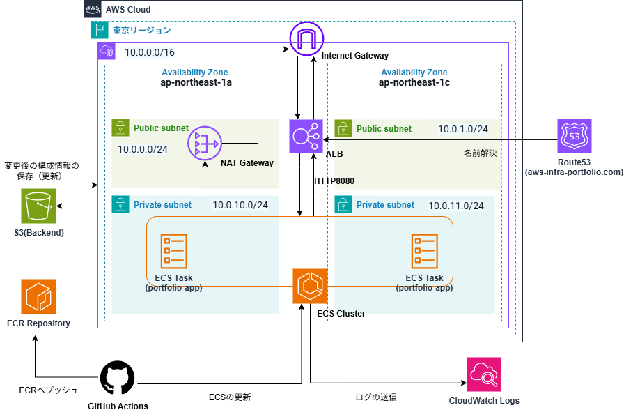

# AWS Container Infrastructure Portfolio

## 1. プロジェクト概要

本プロジェクトは、AWS上にECS FargateとTerraformを用いて構築した、コンテナベースのWebアプリケーション基盤です。

IaC、CI/CD、自動化、ネットワーク分離などを取り入れ、運用を意識した構成としています。

主な目的は以下です。

- TerraformによるInfrastructure as Codeの実践
- ECS Fargateを用いたコンテナ運用
- GitHub ActionsによるCI/CD自動化
- AWSネットワーク設計の理解
- 運用コストを意識した環境管理

---

## 2. システムアーキテクチャ



### 構成概要

- Multi-AZ構成（ap-northeast-1a / 1c）
- Public / Private Subnet分離
- ALBによるL7ロードバランシング
- ECS Fargateによるコンテナ実行
- Route 53によるDNS管理
- CloudWatch Logsによるログ集約
- GitHub ActionsによるCI/CD

---

## 3. 動作確認項目

### 確認可能な情報

`/api/info` では以下を確認できます。

- ECS Taskが稼働しているAvailability Zone
- ECS内部ホスト名
- リクエスト処理回数
- Client IP Address
- 元クライアントIP
- リクエスト追跡ID
- User-Agent

### 確認内容

- ALBによる負荷分散
- Multi-AZ環境でのタスク分散
- リバースプロキシ経由のヘッダー伝播
- ECSタスクのデプロイ状況

---

## 4. 採用技術と設計意図

| 技術 | 設計意図 |
| --- | --- |
| **ECS Fargate** | EC2インスタンス管理を不要にし、コンテナ実行に集中するため。 |
| **Terraform** | Infrastructure as Codeによる再現性の高いインフラ管理を行うため。 |
| **Terraform Module** | VPC、ECS、ALBなどをモジュール化し、再利用性と保守性を向上させるため。 |
| **Private Subnet** | アプリケーションを外部ネットワークから直接公開しない構成とするため。 |
| **NAT Gateway** | Private Subnet内から外部通信を可能にするため。 |
| **ALB** | ECSタスクへの負荷分散およびヘルスチェックを行うため。 |
| **Route 53** | ドメイン管理およびALBとのDNS連携を行うため。 |
| **GitHub Actions** | ビルド・デプロイ作業を自動化するため。 |
| **CloudWatch Logs** | アプリケーションログを集中管理するため。 |
| **IAM Role** | 最小権限でECSタスクを実行するため。 |

---

## 5. 運用面での工夫

### コスト最適化

開発環境のAWSコスト削減を目的として、GitHub ActionsのCron機能を利用しています。

未使用時間帯にはTerraform destroyを実行し、業務開始前に再デプロイする運用としています。

稼働時間：平日9:00～19:00

### Terraform State管理

TerraformのtfstateファイルはS3バックエンドで管理しています。

また、S3の機能、`use_lockfile`によるロック機構を利用し、`terraform apply` の競合を防止しています。

### ログ管理

CloudWatch Logsへログを集約し、コンテナ障害時の調査や動作確認を行いやすい構成としています。

### セキュリティ

- Security Groupによる通信制御
- ALBからECSへの通信のみ許可
- IAM Roleによる最小権限構成
- Private Subnetによる外部公開範囲の制限

---

## 6. ディレクトリ構成

```text
.
├── .github
│   └── workflows
│       ├── deploy.yml    # Goアプリのビルド・デプロイ
│       └── infra.yml    # インフラのスケジュール管理(apply/destroy)
│
├── docs
│  └──architecture.png    # システム構成図
│
├── README.md    # 本ドキュメント
│
├──.gitignore    # Git管理除外設定
│
├── app
│   ├── .dockerignore    # Dockerイメージビルド時の不要ファイル除外設定
│   ├── go.sum            # Goの依存関係管理ファイル
│   ├── main.go            # Goアプリケーション本体（/api/info エンドポイント実装）
│   ├── Dockerfile        #コンテナ定義
│   └── go.mod            # Goの依存関係管理ファイル
│
└── infra
    ├── bootstrap
    │   ├── main.tf        # 初期の共通基盤構築（S3 Backend）
    │   └── variables.tf
    │
    ├── environments
    │   └── dev
    │       ├── main.tf        # 各モジュールの呼び出しとリソースの結合
    │       └── outputs.tf
    │
    └── modules
        ├── vpc
        │   ├── main.tf          # Networkリソース(VPC/Subnet/NATGW)
        │   ├── variables.tf
        │   └── outputs.tf
        ├── ecs
        │   ├── main.tf          # Computeリソース(Cluster/Service/Task)
        │   ├── variables.tf
        │   └── outputs.tf
        ├── alb
        │   ├── main.tf          # LoadBalancer/TargetGroup/Listener
        │   ├── variables.tf
        │   └── outputs.tf
        ├── ecr
        │   ├── main.tf          # Container Registry
        │   ├── variables.tf
        │   └── outputs.tf
        ├── route53
        │   ├── main.tf          # DNSレコード設定
        │   ├── variables.tf
        │   └── outputs.tf
        └── iam
            ├── main.tf          # ECS Task Execution Role等
            ├── variables.tf
            └── outputs.tf
```

---

## 7. セットアップ

### Terraform Backend(S3)初期化

```bash
cd infra/bootstrap

terraform init
terraform apply
```

### インフラ構築

```bash
cd infra/environments/dev

terraform init
terraform apply
```

### アプリケーションデプロイ

`main` ブランチへPushすると、GitHub Actionsが以下を自動実行します。

1. Docker Image Build
2. Amazon ECR Push
3. ECS Service Update

---

## 8. 今後の改善予定

以下の機能追加・改善を予定しています。

### セキュリティ

- AWS WAF導入
- CloudFront導入
- ACMによるHTTPS化

### スケーラビリティ

- ECS Service Auto Scaling
- 環境ごとの構成分離（dev/stg/prd）

### デプロイ戦略

- AWS CodeDeployによるBlue/Green Deployment

### データベース

- Amazon RDS PostgreSQL導入
- Multi-AZ構成対応

### 監視・可観測性

- OpenTelemetry導入
- CloudWatch Dashboard構築
- メトリクス監視強化

---

## 9. 学習目的

本プロジェクトでは以下の実践的な技術習得を目的としています。

- AWSインフラ設計
- TerraformによるIaC
- Dockerコンテナ運用
- ECS Fargate構築
- GitHub ActionsによるCI/CD
- AWSネットワーク設計
- セキュリティ設計
- 運用コスト最適化
- ログ管理と監視
